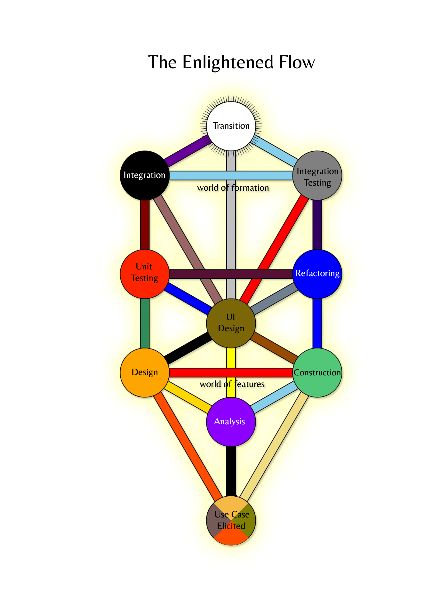

# Manifesto for Kabbalah Software Development

As God created everything that is destined to come into being through letters,
hence we shalt dutifully connect the essence of a business model with its physical form by drawing,
hewing, combining and interchanging the symbols of a programming language,
using the wisdom of forefathers unveiled in the Tree Of Sefirot and following the Limitless Light in the eternal cycle of the perfect software formation

Copyright  © 2013 Yuri Vanin & Vladimir Galkin.